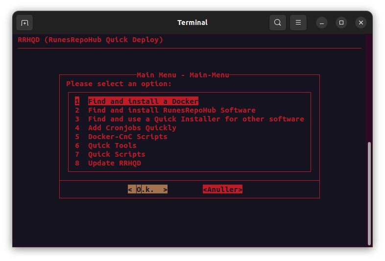
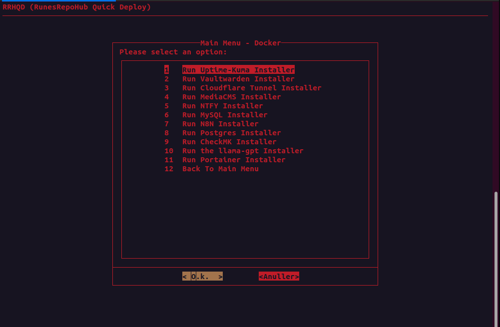
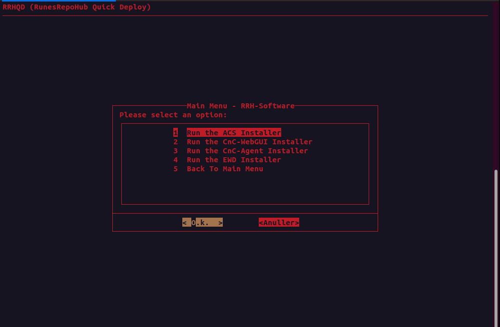
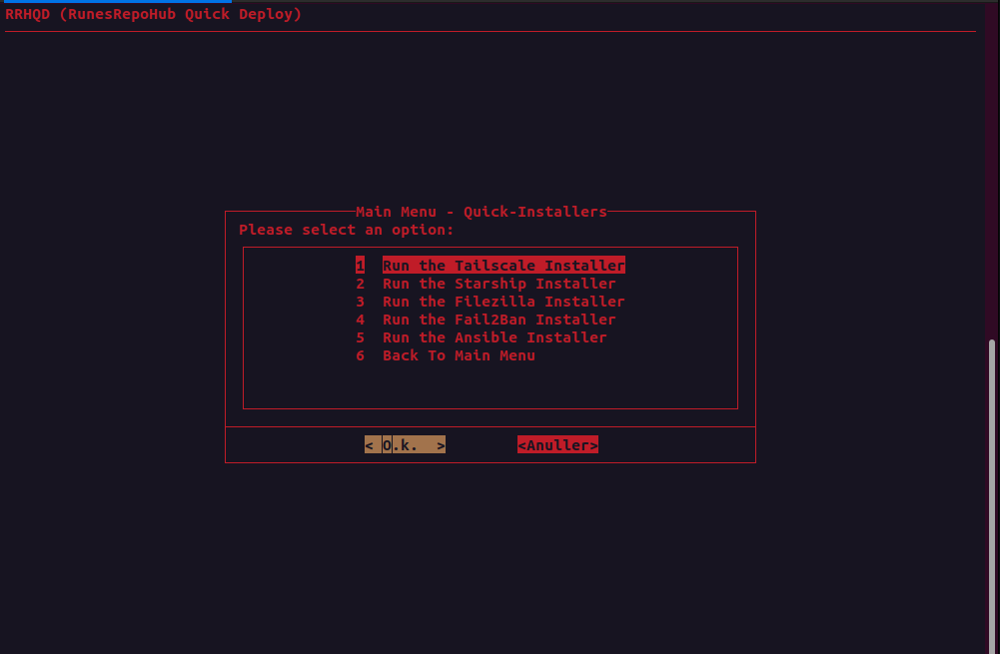
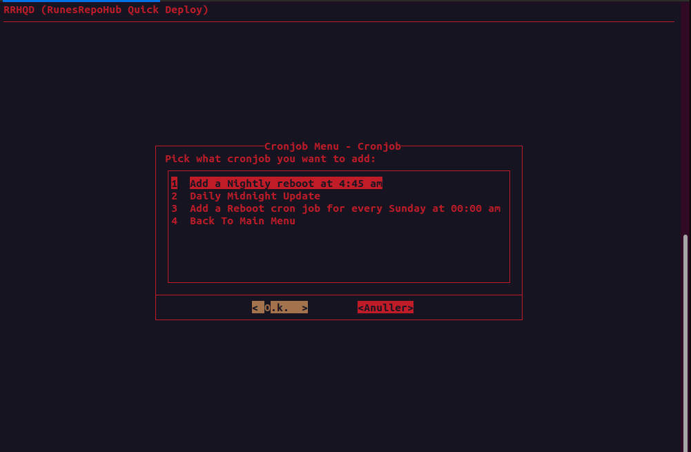
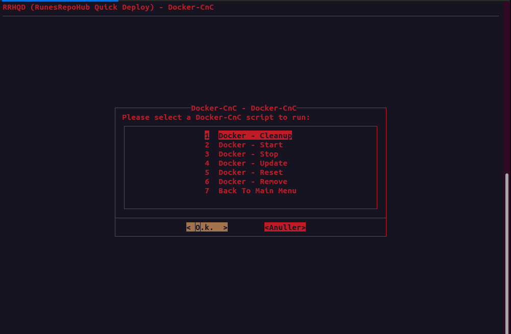
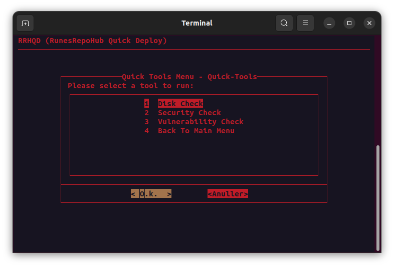
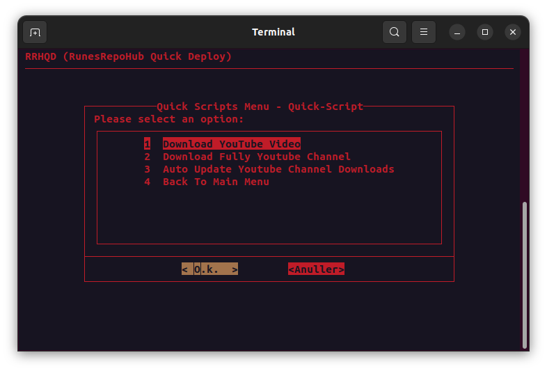
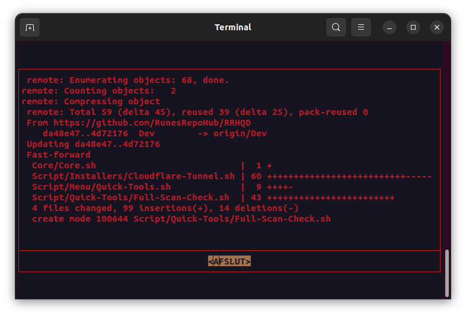

# RRHQD
RunesRepoHub Quick Deploy this script has been made to make it easy to deploy the most used docker, software and other installers that we use.



### Current Versions:

1. Dev = Development branch (Very unstable)
2. PoC = Proof of concept (Nightly Updates)
3. Prod = Production (Stable branch)

---------------------------------------------------------------------------------------------

### Docker Support:



- Uptime-Kuma - A fancy self-hosted monitoring tool
- Vaultwarden - An unofficial Bitwarden compatible server
- Cloudflare Tunnel - Securely connect your network to the Internet
- MediaCMS - A modern, fully featured open source video and media CMS
- CheckMK - A unified monitoring and alerting system
- MySQL - The world's most popular open source database
- NTFY - A simple and powerful notification service
- Postgres - The world's most popular open source database
- N8N - A workflow automation platform
- llama-GPT - A modern, open source chat bot.
- Portainer - A web management interface for Docker

---------------------------------------------------------------------------------------------

### RunesRepoHub Software Support:



* ACS (Automated Content System)
* News Report Docker (Automated News Reporting System)
* EWD (Easy Web Development)

---------------------------------------------------------------------------------------------

### Quick Installer Support:



* Starship - A minimalistic, powerful, and extremely customizable prompt for any shell
* Tailscale VPN - A private network that makes securing your online activity and managing your devices easy
* Filezilla - A free software, cross-platform FTP application that supports FTP, SFTP, and FTPS
* Fail2Ban - An intrusion prevention software framework that protects computer servers from brute-force attacks
* Ansible - A radically simple IT automation tool

* Docker (is auto installed) - A set of platform as a service products that use OS-level virtualization to deliver software in packages called containers

---------------------------------------------------------------------------------------------

### Cronjobs



- Add a nightly reboot at 4:45 am
- Daily midnight update (Debian Systems)
- Add a reboot cronjob for every Sunday at 00:00 am

---------------------------------------------------------------------------------------------

### Docker Command and Control



- Docker - Cleanup (Clean all unused images, volumes and networks)
- Docker - Remove (Stop and Delete a Docker)
- Docker - Reset (Reset Docker - Delete everything)
- Docker - Start (Start all Docker)
- Docker - Stop (Stop all Docker)
- Docker - Update (Update a Docker)
***- Docker - Export (Export a Docker) (Still in testing)***
***- Docker - Import (Import a Docker) (Still in testing)***

---------------------------------------------------------------------------------------------

### Quick Tools



(Early Access) Has not been full tested yet.

- Disk Space - Check disk space
- Security - Check security
- Vulnerability - Check vulnerability
- Full Scan Check - Check all 

---------------------------------------------------------------------------------------------

### Quick Scripts



(These scripts are made to work with the ACS)

***IT WILL NOT WORK WITHOUT THE ACS***

- Download Youtube Video - Download a youtube playlist
- Download Full Youtube Channel - Add a youtube channel to download
- Auto Update Youtube Channel Downloads - Check if there are new videos on the channel

---------------------------------------------------------------------------------------------

### Update RRHQD



This will do a git pull based on the selected branch on install. After the script will exit, this is done to make sure the script is up to date. Just run the script again.  

---------------------------------------------------------------------------------------------

### Dependencies folders:

* RRHQD
* RRHQD-Dockers

> Note: The Docker compose files and the docker volumes are stored in the "RRHQD-Dockers" folder (SO DONT DELETE IT, unless you know what you are doing). The "RRHQD" folder is the main folder for the script.

## How to use

Run the setup via the command below.

Follow the setup "guide" after.

When asked what branch do you want to use, select the branch you want to use. If you want to use a stable branch, select "Prod".

If you want to the nightly updated code base, then use the "PoC" branch.

***Don't use the Dev branch***

```
bash <(wget -qO- https://raw.githubusercontent.com/RunesRepoHub/RRHQD/Prod/Setup.sh)
```

### Custom Commands 

If you want to access the script again after exiting it use the command below.

```
qd
```
