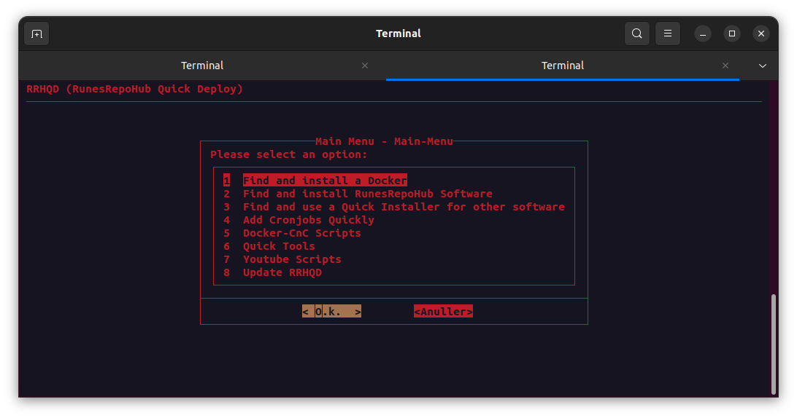
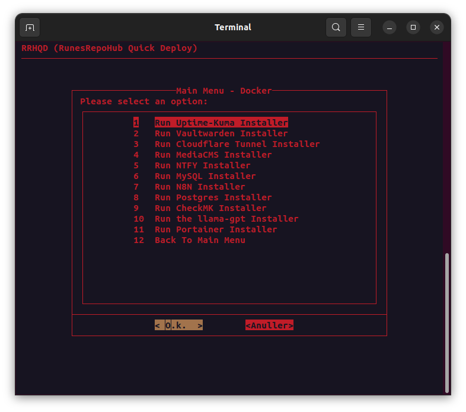
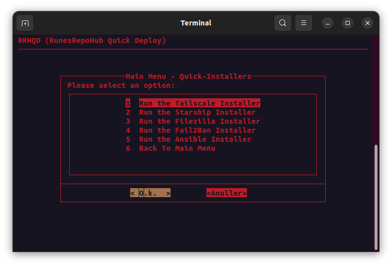
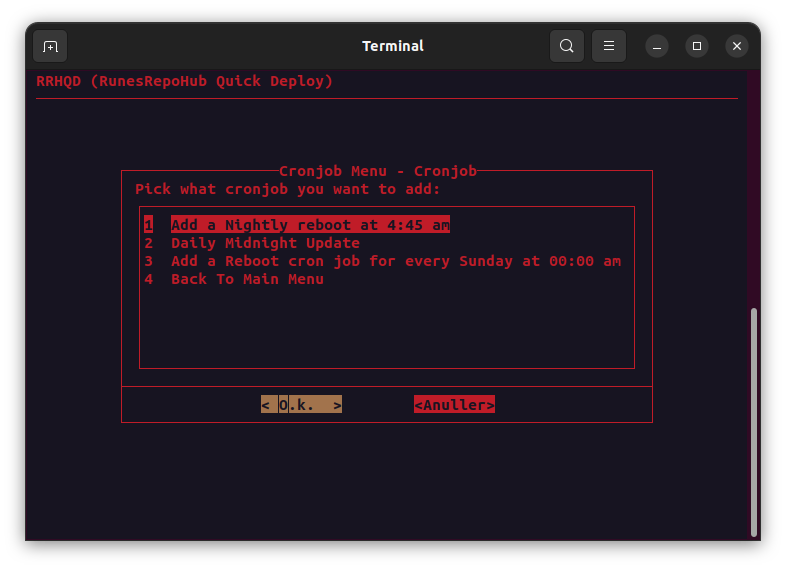
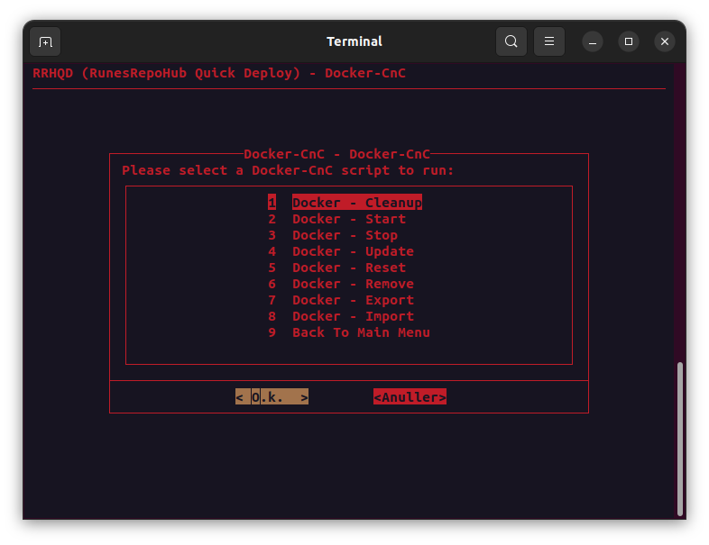
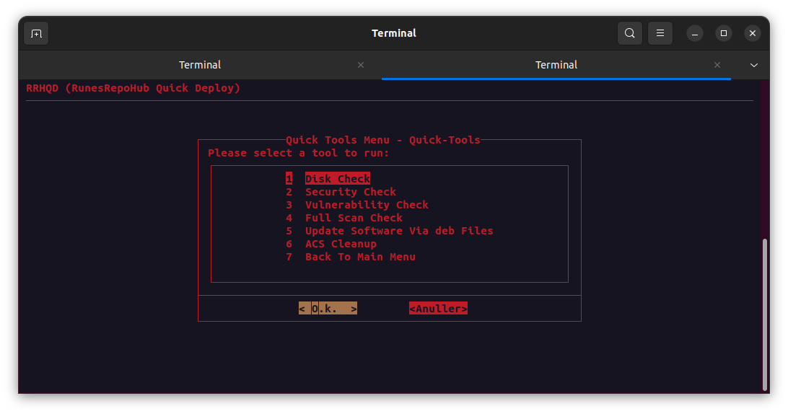
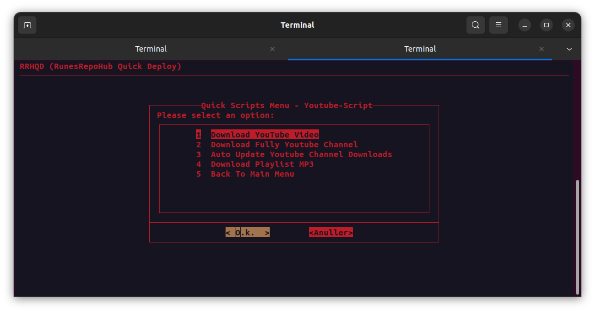

<p align="center">
  
</p>

# RRHQD
The "RRHQD" script is a comprehensive deployment tool designed to streamline the setup and management of diverse applications on Linux systems. Its primary goal—simplifying the deployment of Docker containers, software, and other tools.

The script automates the installation of essential prerequisites, including Sudo, Docker, Git, Curl, and Dialog, ensuring a smooth deployment experience. It has been designed to provide compatibility with various operating systems such as Debian, Ubuntu, Linuxmint, Kali Linux, and Zorin OS.

The development of the script is based on managing different development stages through branches like Dev, PoC, and Prod, the script offers users flexibility in choosing the stability level that suits their needs. The interactive main menu categorizes options for Docker support, RunesRepoHub software, quick installers, cronjobs, Docker command control, quick tools and YouTube scripts.

RRHQD provides a user-friendly and efficient solution for deploying and managing applications on Linux systems.

# Requirements

> [!WARNING]
>- Sudo (is auto installed by setup)
>- Docker (is auto installed by setup)
>- Git (is auto installed by setup)
>- Curl (is auto installed by setup)
>- Dialog (is auto installed by setup and has a theme override)

# Operating Systems Supported

> [!TIP]
>- Debian 10 - 11
>- Ubuntu 20.04 - 22.04
>- Linuxmint 21.3 - Cinnamon
>- Kail Linux 2023.4 
>- Zorin OS - 17 - Core

# Current Versions

>[!CAUTION]
>1. Dev = Development branch (Very unstable)
>2. PoC = Proof of concept (Nightly Updates)
>3. Prod = Production (Stable branch)

## Main Menu



---------------------------------------------------------------------------------------------

## Docker Support



**Every docker "Installer" has been tested and is working.**

> [!IMPORTANT]
> Pay attention to:
>
>- If the input can be skipped or not. (Else the docker might not work)
>- All dockers are in the "RRHQD-Dockers" folder. 
>- All dockers are made using docker compose files.
>- All docker compose files are located in "RRHQD-Dockers"

### Docker images currently supported

> [!NOTE]
>- Uptime-Kuma - A fancy self-hosted monitoring tool
>- Vaultwarden - An unofficial Bitwarden compatible server
>- Cloudflare Tunnel - Securely connect your network to the Internet
>- ~~MediaCMS - A modern, fully featured open source video and media CMS~~ (Not supported, due to unstable scripts, working on fix)
>- CheckMK - A unified monitoring and alerting system
>- MySQL - The world's most popular open source database
>- NTFY - A simple and powerful notification service
>- Postgres - The world's most popular open source database
>- N8N - A workflow automation platform
>- llama-GPT - A modern, open source chat bot.
>- Portainer - A web management interface for Docker
>- Deluge - A lightweight torrent client
>- Ghost - A simple, powerful, and open source content management system
>- Radarr - A self-hosted media server download manager and torrent tracker for movies
>- Sonarr - A self-hosted media server download manager and torrent tracker for shows
>- Ombi - A self-hosted reqests and media management system
>- It-tools - A collection of tools for IT professionals
>- Linkwarden - A self-hosted url manager
>- Memos - A self-hosted twitter-ish service


---------------------------------------------------------------------------------------------

## RunesRepoHub Software Support


> [!NOTE]
>* ACS (Automated Content System) - [ACS Wiki](https://runesrepohub.github.io/ACS/)
>* News Report Docker (Automated News Reporting System) - [NRD Readme](https://github.com/RunesRepoHub/NRD)
>* EWD (Easy Web Development) - [EWD Repo](https://github.com/RunesRepoHub/EWD)

---------------------------------------------------------------------------------------------

## Quick Installer Support



> [!NOTE]
>* Starship - A minimalistic, powerful, and extremely customizable prompt for any shell
>* Tailscale VPN - A private network that makes securing your online activity and managing your devices easy
>* Filezilla - A free software, cross-platform FTP application that supports FTP, SFTP, and FTPS
>* Fail2Ban - An intrusion prevention software framework that protects computer servers from brute-force attacks
>* Ansible - A radically simple IT automation tool
>* Pydio - An open source cloud collaboration tool

---------------------------------------------------------------------------------------------

## Cronjobs



> [!NOTE]
>- Add a nightly reboot at 4:45 am
>- Daily midnight update (Debian Systems)
>- Add a reboot cronjob for every Sunday at 00:00 am
>- Cronjob Manager - Easy and quick custom cronjob
>- Cronmointer - Easy WebGUI Interface to keep track of cronjobs

---------------------------------------------------------------------------------------------

## Docker Command and Control



> [!NOTE]
>- Docker - Cleanup (Clean all unused images, volumes and networks)
>- Docker - Remove (Stop and Delete a Docker)
>- Docker - Reset (Reset Docker - Delete everything)
>- Docker - Start (Start one or more Dockers)
>- Docker - Stop (Stop one or more Dockers)
>- Docker - Update (Update a Docker)

---------------------------------------------------------------------------------------------

## Quick Tools



(Early Access) Has not been full tested yet.
> [!WARNING]
>- Disk Space - Check disk space
>- Security - Check security
>- Vulnerability - Check vulnerability
>- Full Scan Check - Check all 
>- Manually Install Software Updates - Install update from deb file in the download folder
>- ACS Cleanup - Check for Dubblicate Entries

---------------------------------------------------------------------------------------------

## Youtube Scripts



> [!WARNING]
>(These scripts are made to work with the ACS)
>
>***IT WILL NOT WORK WITHOUT INSTALLING THE ACS First*** 
>[Install ACS](https://github.com/RunesRepoHub/RRHQD#runesrepohub-software-support)

> [!NOTE]
>- Download Youtube Video - Download a youtube playlist
>- Download Full Youtube Channel - Add a youtube channel to download
>- Auto Update Youtube Channel Downloads - Check if there are new videos on the channel
>- Download Youtube Playlist MP3 - Download a youtube playlist in mp3
>- Stop all Youtube Downloads - Stop all youtube downloads
>- Scan all Youtube Downloads - Scan all youtube downloads every 20 min 

---------------------------------------------------------------------------------------------

## Update RRHQD

> [!NOTE]
>The script will pull the latest version of the script. Every time you run it, it will update itself. Some updates may require you to restart the script to take effect. 

> [!CAUTION]
>***DO NOT CHANGE THE FILES IN THE RRHQD FOLDER***
>
>Doing so may break the script. You can modify the files in the RRHQD-Dockers folder.

---------------------------------------------------------------------------------------------

## Dependencies folders
> [!WARNING]
>* RRHQD
>* RRHQD-Dockers
>
> Note: The Docker compose files and the docker volumes are stored in the "RRHQD-Dockers" folder (SO DONT DELETE IT, unless you know what you are doing). The "RRHQD" folder is the main folder for the script.

# How to use

> [!TIP]
>- Run the setup via the command below.
>
>- Follow the setup "guide" after.
>
>- When asked what branch do you want to use, select the branch you want to use. If you want to use a stable branch, select "Prod".
>
>- If you want to the nightly updated code base, then use the "PoC" branch.

> [!CAUTION]
>***Don't use the Dev branch***

## Setup Command

```
bash <(wget -qO- https://raw.githubusercontent.com/RunesRepoHub/RRHQD/Prod/Setup.sh)
```

## Custom Commands 
> [!NOTE]
>To use custom commands you will have to run 

> [!WARNING]
>***This is for Ubuntu, Debian, Zorin OS and Linux Mint.***

```
source ~/.bashrc
```

> [!WARNING]
>***This is for Kali Linux***

```
source ~/.zshrc
```

--------------------------------------------------------------------

> [!TIP]
>If you want to access the script again after exiting it use the command below.

```
qd
```

