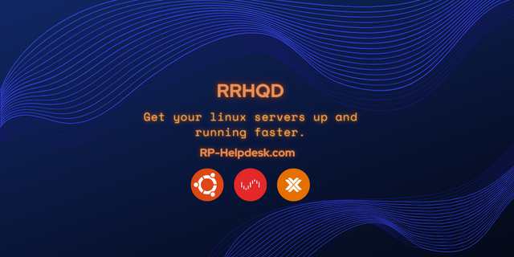

  
  
  

# RRHQD
The "RRHQD" script is a comprehensive deployment tool designed to streamline the setup and management of diverse applications on Linux systems. Its primary goal—simplifying the deployment of Docker containers, software, and other tools.

The script automates the installation of essential prerequisites, including Sudo, Docker, Git, Curl, and Dialog, ensuring a smooth deployment experience. It has been designed to provide compatibility with various operating systems such as Debian, Ubuntu, Linuxmint, Kali Linux, and Zorin OS.

The development of the script is based on managing different development stages through branches like Dev, PoC, and Prod, the script offers users flexibility in choosing the stability level that suits their needs. The interactive main menu categorizes options for Docker support, RunesRepoHub software, quick installers, cronjobs, Docker command control, quick tools and YouTube scripts.

RRHQD provides a user-friendly and efficient solution for deploying and managing applications on Linux systems.

## Help and Guidance

* [Requirements](docs/Readme/Requirements.md)
* [Installation](docs/Readme/Installation.md)
* [Main Menu](docs/Readme/Main-Menu.md)
* [Docker Support](docs/Readme/Docker-Support.md)
* [RunesRepoHub Software](docs/Readme/RunesRepoHub.md)
* [Cronjobs](docs/Readme/Cronjobs.md)
* [Youtube Scripts](docs/Readme/Youtube-Scripts.md)
* [Quick Installers](docs/Readme/Quick-Installer.md)
* [Quick Tools](docs/Readme/Quick-Tools.md)
* [Docker-CnC](docs/Readme/Docker-CnC.md)

---------------------------------------------------------------------------------------------

