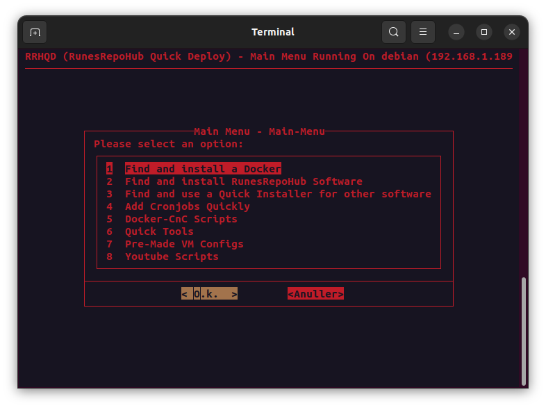

  

# RRHQD
The "RRHQD" script is a comprehensive deployment tool designed to streamline the setup and management of diverse applications on Linux systems. Its primary goal—simplifying the deployment of Docker containers, software, and other tools.

The script automates the installation of essential prerequisites, including Sudo, Docker, Git, Curl, and Dialog, ensuring a smooth deployment experience. It has been designed to provide compatibility with various operating systems such as Debian, Ubuntu, Linuxmint, Kali Linux, and Zorin OS.

The development of the script is based on managing different development stages through branches like Dev, PoC, and Prod, the script offers users flexibility in choosing the stability level that suits their needs. The interactive main menu categorizes options for Docker support, RunesRepoHub software, quick installers, cronjobs, Docker command control, quick tools and YouTube scripts.

RRHQD provides a user-friendly and efficient solution for deploying and managing applications on Linux systems.

## Requirements

> [!WARNING]
>- Sudo (is auto installed by setup)
>- Docker (is auto installed by setup)
>- Git (is auto installed by setup)
>- Curl (is auto installed by setup)
>- Dialog (is auto installed by setup and has a theme override)

## Operating Systems Supported

> [!TIP]
>- Debian 10 - 11
>- Ubuntu 20.04 - 22.04
>- Linuxmint 21.3 - Cinnamon
>- Kail Linux 2023.4 
>- Zorin OS - 17 - Core

## Current Versions

>[!CAUTION]
>1. Dev = Development branch (Very unstable)
>2. PoC = Proof of concept (Nightly Updates)
>3. Prod = Production (Stable branch)

## Main Menu

## Update RRHQD

> [!NOTE]
>The script will pull the latest version of the script. Every time you run it, it will update itself. Some updates may require you to restart the script to take effect. 

> [!CAUTION]
>***DO NOT CHANGE THE FILES IN THE RRHQD FOLDER***
>
>Doing so may break the script. You can modify the files in the RRHQD-Dockers folder.

---------------------------------------------------------------------------------------------

[Installation](docs/Readme/Installation.md)
[Docker Support](docs/Readme/Docker-Support.md)
[RunesRepoHub Software](docs/Readme/RunesRepoHub.md)
[Cronjobs](docs/Readme/Cronjobs.md)
[Youtube Scripts](docs/Readme/Youtube-Scripts.md)
[Quick Installers](docs/Readme/Quick-Installer.md)
[Quick Tools](docs/Readme/Quick-Tools.md)
[Docker-CnC](docs/Readme/Docker-CnC.md)
