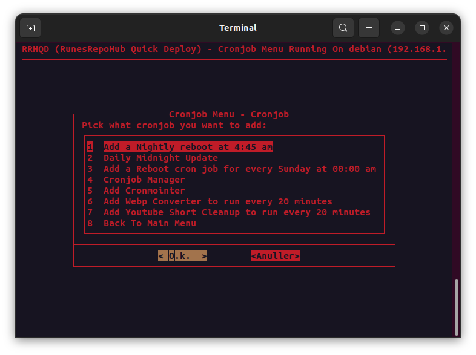

<h2> Cronjobs </h2>

!!! Important "**Cronjobs**"

    - Add a nightly reboot at 4:45 am
    - Daily midnight update (Debian Systems)
    - Add a reboot cronjob for every Sunday at 00:00 am
    - Cronjob Manager - Easy and quick custom cronjob
    - Cronmointer - Easy WebGUI Interface to keep track of cronjobs
    - Add Webp Converter to run every 20 minutes
    - Add Youtube Short Cleanup to run every 20 minutes
