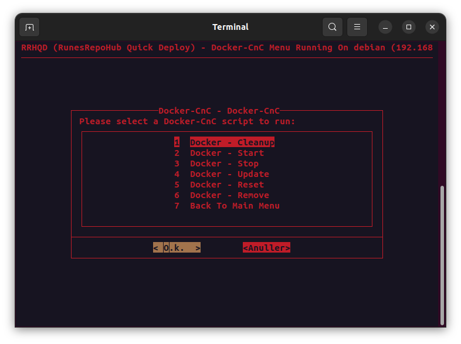

<h2> Docker Command and Control </h2>

!!! Important "**Docker Command and Control**"

    - Docker - Cleanup (Clean all unused images, volumes and networks)
    - Docker - Remove (Stop and Delete a Docker)
    - Docker - Reset (Reset Docker - Delete everything)
    - Docker - Start (Start one or more Dockers)
    - Docker - Stop (Stop one or more Dockers)
    - Docker - Update (Update a Docker)

