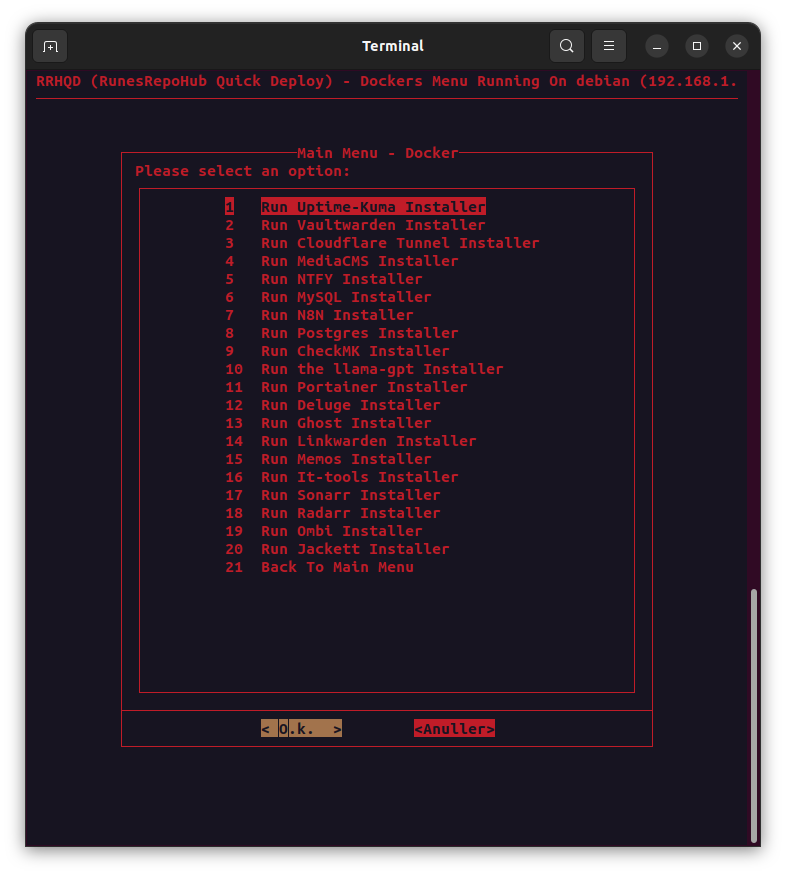

<h2> Docker Support </h2>

**Every docker "Installer" has been tested and is working.**

!!! info "RRHQD-Dockers"

     Pay attention to:

    - If the input can be skipped or not. (Else the docker might not work)
    - All dockers are in the "RRHQD-Dockers" folder. 
    - All dockers are made using docker compose files.
    - All docker compose files are located in "RRHQD-Dockers"

<h3> Docker images currently Supported </h3>

!!! important "Docker images supported"

    - Uptime-Kuma - A fancy self-hosted monitoring tool
    - Vaultwarden - An unofficial Bitwarden compatible server
    - Cloudflare Tunnel - Securely connect your network to the Internet
    - ~~MediaCMS - A modern, fully featured open source video and media CMS~~ (Not supported, due to unstable scripts, working on fix)
    - CheckMK - A unified monitoring and alerting system
    - MySQL - The world's most popular open source database
    - NTFY - A simple and powerful notification service
    - Postgres - The world's most popular open source database
    - N8N - A workflow automation platform
    - llama-GPT - A modern, open source chat bot.
    - Portainer - A web management interface for Docker
    - Deluge - A lightweight torrent client
    - Ghost - A simple, powerful, and open source content management system
    - Radarr - A self-hosted media server download manager and torrent tracker for movies
    - Sonarr - A self-hosted media server download manager and torrent tracker for shows
    - Ombi - A self-hosted reqests and media management system
    - It-tools - A collection of tools for IT professionals
    - Linkwarden - A self-hosted url manager
    - Memos - A self-hosted twitter-ish service
    - Jackett - A self-hosted torrent tracker 
