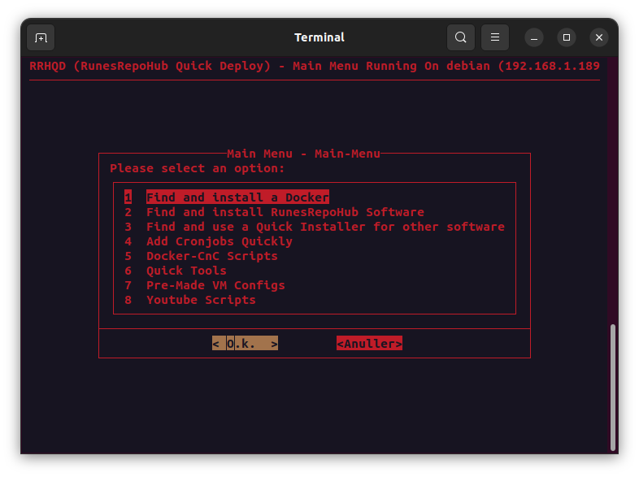

## Main Menu

## Update RRHQD

> [!NOTE]
>The script will pull the latest version of the script. Every time you run it, it will update itself. Some updates may require you to restart the script to take effect. 

> [!CAUTION]
>***DO NOT CHANGE THE FILES IN THE RRHQD FOLDER***
>
>Doing so may break the script. You can modify the files in the RRHQD-Dockers folder.
