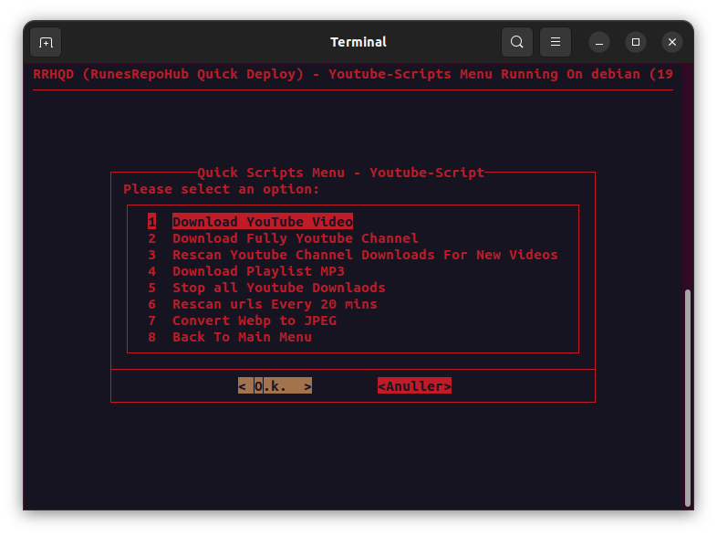

<h2> Youtube Scripts </h2>

!!! important "**Youtube Scripts**"

    (These scripts are made to work with the ACS)

    ***IT WILL NOT WORK WITHOUT INSTALLING THE ACS First*** 
    [Install ACS](RunesRepoHub.md)

!!! warning "**Youtube Scripts Features**"

    - Download Youtube Video - Download a youtube playlist
    - Download Full Youtube Channel - Add a youtube channel to download
    - Auto Update Youtube Channel Downloads - Check if there are new videos on the channel
    - Download Youtube Playlist MP3 - Download a youtube playlist in mp3
    - Stop all Youtube Downloads - Stop all youtube downloads
    - Scan all Youtube Downloads - Scan all youtube downloads every 20 min 
    - Convert Webp to jpeg - For Plex Enabled Thumbnails

