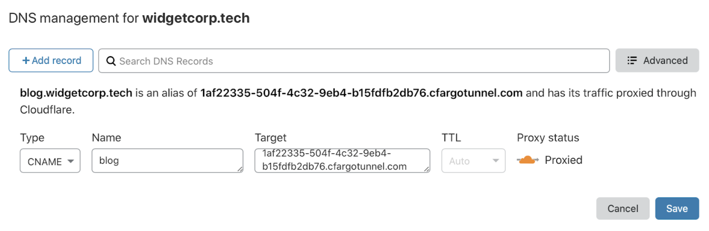

# Setup a Cloudflare Tunnel Docker

<h1> Set up instructions </h1>
<h4>Follow the setup these instructions to configure the system.</h4>

<iframe width="560" height="315" src="https://media.rp-helpdesk.com/embed?m=OSZ7f1wQr" frameborder="0" allowfullscreen></iframe>

### Instructions
!!! tip

    1. Pick branch to install from. = Prod

    2. Go to the menu "Find and install a docker"

    3. Find the cloudflare tunnel docker
        - You can get more help if you need.
        - Let the cloudflare docker download (This can take a few minutes).

    4. When the cloudflare docker is up and running, you will have to login to cloudflare to download certificates.

    5. When you have logged in, you can Authorize the cloudflare tunnel.

    6. Give your cloudflare tunnel a name
        - This will gernerate a id for the tunnel

    7. Pick if you are going to use the cloudflare tunnel for one or more websites

    8. Copy and input your cloudflare tunnel id
        - Both in the cli and in the cloudflare dns dashboard

!!! tip

    9. Pick if the services are http or https (What ever protocol you use when accessing the website on LAN)

    10. Input your reverse proxy IP (What ever IP you use when accessing the website on LAN)

    11. Input your port (What ever port you use when accessing the website on LAN)

    12. Input your domain name (What ever domain you want use when accessing the website on WAN)