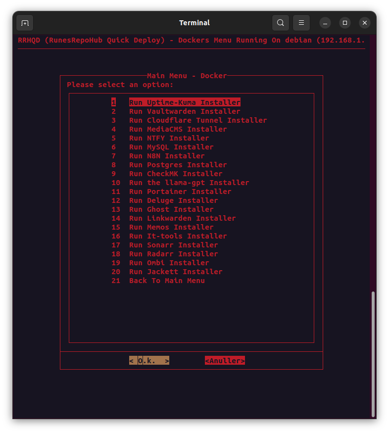

## Docker Support

**Every docker "Installer" has been tested and is working.**

> [!IMPORTANT]
> Pay attention to:
>
>- If the input can be skipped or not. (Else the docker might not work)
>- All dockers are in the "RRHQD-Dockers" folder. 
>- All dockers are made using docker compose files.
>- All docker compose files are located in "RRHQD-Dockers"

### Docker images currently supported

> [!NOTE]
>- Uptime-Kuma - A fancy self-hosted monitoring tool
>- Vaultwarden - An unofficial Bitwarden compatible server
>- Cloudflare Tunnel - Securely connect your network to the Internet
>- ~~MediaCMS - A modern, fully featured open source video and media CMS~~ (Not supported, due to unstable scripts, working on fix)
>- CheckMK - A unified monitoring and alerting system
>- MySQL - The world's most popular open source database
>- NTFY - A simple and powerful notification service
>- Postgres - The world's most popular open source database
>- N8N - A workflow automation platform
>- llama-GPT - A modern, open source chat bot.
>- Portainer - A web management interface for Docker
>- Deluge - A lightweight torrent client
>- Ghost - A simple, powerful, and open source content management system
>- Radarr - A self-hosted media server download manager and torrent tracker for movies
>- Sonarr - A self-hosted media server download manager and torrent tracker for shows
>- Ombi - A self-hosted reqests and media management system
>- It-tools - A collection of tools for IT professionals
>- Linkwarden - A self-hosted url manager
>- Memos - A self-hosted twitter-ish service
>- Jackett - A self-hosted torrent tracker

---------------------------------------------------------------------------------------------

## Help and Guidance

[![Button Icon1]][Link1]

[![Button Icon2]][Link2]

[![Button Icon3]][Link3]

[![Button Icon4]][Link4]

[![Button Icon5]][Link5]

[![Button Icon6]][Link6]

[![Button Icon7]][Link7]

[![Button Icon8]][Link8]

[![Button Icon9]][Link9]

[![Button Icon10]][Link10]

---------------------------------------------------------------------------------------------

<!---------------------------------------------------------------------------->
[Link1]: Requirements.md
[Link2]: Installation.md
[Link3]: Main-Menu.md
[Link4]: Docker-Support.md
[Link5]: RunesRepoHub.md
[Link6]: Cronjobs.md
[Link7]: Youtube-Scripts.md
[Link8]: Quick-Installer.md
[Link9]: Quick-Tools.md
[Link10]: Docker-CnC.md

<!---------------------------------[ Buttons ]--------------------------------->
[Button Icon1]: https://img.shields.io/badge/Requirements-page?style=for-the-badge&logo=readthedocs&logoColor=white&color=blue
[Button Icon2]: https://img.shields.io/badge/Installation-EF2D5E?style=for-the-badge&logoColor=white&logo=DocuSign
[Button Icon3]: https://img.shields.io/badge/Main%20Menu-page?style=for-the-badge&logo=databricks&logoColor=white&color=green
[Button Icon4]: https://img.shields.io/badge/Docker%20Support-page?style=for-the-badge&logo=docker&logoColor=white&color=blue
[Button Icon5]: https://img.shields.io/badge/RunesRepoHub%20Software-page?style=for-the-badge&logo=r&logoColor=white&color=orange
[Button Icon6]: https://img.shields.io/badge/Cronjobs-page?style=for-the-badge&logo=convertio&logoColor=white&color=purple
[Button Icon7]: https://img.shields.io/badge/Youtube%20Scripts-page?style=for-the-badge&logo=youtube&logoColor=white&color=red
[Button Icon8]: https://img.shields.io/badge/Quick%20Installers-page?style=for-the-badge&logo=quicktime&logoColor=white&color=yellow
[Button Icon9]: https://img.shields.io/badge/Quick%20Tools-page?style=for-the-badge&logo=azurefunctions&logoColor=white&color=darklime
[Button Icon10]: https://img.shields.io/badge/Docker%20CnC-page?style=for-the-badge&logo=docker&logoColor=white&color=darkblue

