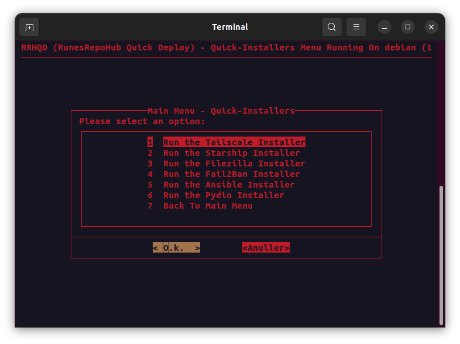

## Quick Installer Support

> [!NOTE]
>* Starship - A minimalistic, powerful, and extremely customizable prompt for any shell
>* Tailscale VPN - A private network that makes securing your online activity and managing your devices easy
>* Filezilla - A free software, cross-platform FTP application that supports FTP, SFTP, and FTPS
>* Fail2Ban - An intrusion prevention software framework that protects computer servers from brute-force attacks
>* Ansible - A radically simple IT automation tool
>* Pydio - An open source cloud collaboration tool

---------------------------------------------------------------------------------------------

## Help and Guidance

[![Button Icon1]][Link1]

[![Button Icon2]][Link2]

[![Button Icon3]][Link3]

[![Button Icon4]][Link4]

[![Button Icon5]][Link5]

[![Button Icon6]][Link6]

[![Button Icon7]][Link7]

[![Button Icon8]][Link8]

[![Button Icon9]][Link9]

[![Button Icon10]][Link10]

---------------------------------------------------------------------------------------------

<!---------------------------------------------------------------------------->
[Link1]: Requirements.md
[Link2]: Installation.md
[Link3]: Main-Menu.md
[Link4]: Docker-Support.md
[Link5]: RunesRepoHub.md
[Link6]: Cronjobs.md
[Link7]: Youtube-Scripts.md
[Link8]: Quick-Installer.md
[Link9]: Quick-Tools.md
[Link10]: Docker-CnC.md

<!---------------------------------[ Buttons ]--------------------------------->
[Button Icon1]: https://img.shields.io/badge/Requirements-page?style=for-the-badge&logo=readthedocs&logoColor=white&color=blue
[Button Icon2]: https://img.shields.io/badge/Installation-EF2D5E?style=for-the-badge&logoColor=white&logo=DocuSign
[Button Icon3]: https://img.shields.io/badge/Main%20Menu-page?style=for-the-badge&logo=databricks&logoColor=white&color=green
[Button Icon4]: https://img.shields.io/badge/Docker%20Support-page?style=for-the-badge&logo=docker&logoColor=white&color=blue
[Button Icon5]: https://img.shields.io/badge/RunesRepoHub%20Software-page?style=for-the-badge&logo=r&logoColor=white&color=orange
[Button Icon6]: https://img.shields.io/badge/Cronjobs-page?style=for-the-badge&logo=convertio&logoColor=white&color=purple
[Button Icon7]: https://img.shields.io/badge/Youtube%20Scripts-page?style=for-the-badge&logo=youtube&logoColor=white&color=red
[Button Icon8]: https://img.shields.io/badge/Quick%20Installers-page?style=for-the-badge&logo=quicktime&logoColor=white&color=yellow
[Button Icon9]: https://img.shields.io/badge/Quick%20Tools-page?style=for-the-badge&logo=azurefunctions&logoColor=white&color=darklime
[Button Icon10]: https://img.shields.io/badge/Docker%20CnC-page?style=for-the-badge&logo=docker&logoColor=white&color=darkblue

