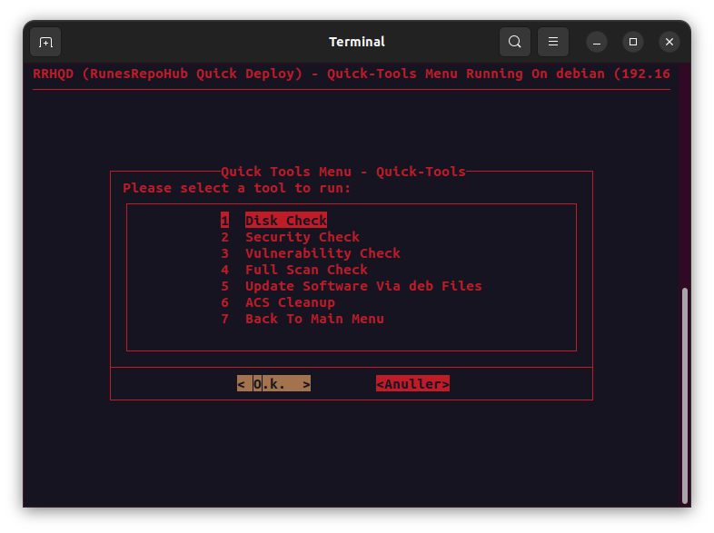

## Quick Tools

(Early Access) Has not been full tested yet.

> [!WARNING]
>- Disk Space - Check disk space
>- Security - Check security
>- Vulnerability - Check vulnerability
>- Full Scan Check - Check all 
>- Manually Install Software Updates - Install update from deb file in the download folder
>- ACS Cleanup - Check for Dubblicate Entries

---------------------------------------------------------------------------------------------

## Help and Guidance

[<kbd>   Requirements   </kbd>][Link1]

[<kbd>   Installation   </kbd>][Link2]

[<kbd>   Main Menu   </kbd>][Link3]

[<kbd>   Docker Support   </kbd>][Link4]

[<kbd>   RunesRepoHub Software   </kbd>][Link5]

[<kbd>   Cronjobs   </kbd>][Link6]

[<kbd>   Youtube Scripts   </kbd>][Link7]

[<kbd>   Quick Installers   </kbd>][Link8]

[<kbd>   Quick Tools   </kbd>][Link9]

[<kbd>   Docker-CnC   </kbd>][Link10]

---------------------------------------------------------------------------------------------

<!---------------------------------------------------------------------------->
[Link1]: Requirements.md
[Link2]: Installation.md
[Link3]: Main-Menu.md
[Link4]: Docker-Support.md
[Link5]: RunesRepoHub.md
[Link6]: Cronjobs.md
[Link7]: Youtube-Scripts.md
[Link8]: Quick-Installer.md
[Link9]: Quick-Tools.md
[Link10]: Docker-CnC.md

